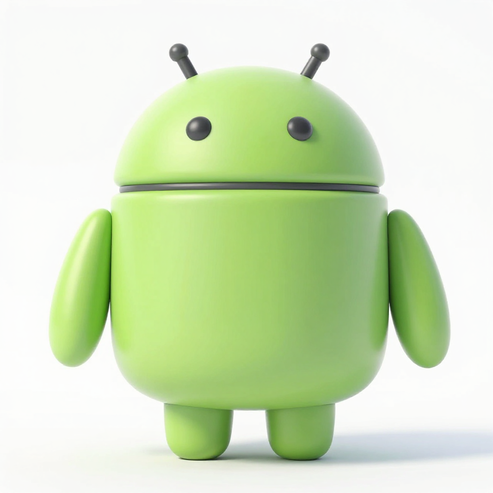

<div align="center">

<h2>AndroidBox</h2>
<p><a href="./README.md">中文</a></p>
</div>

### 1. Feature Overview

- A windowed runner for Android based on [Waydroid](https://github.com/waydroid/waydroid). The Linux native container backend is preserved, and a cross-platform desktop client built on Qt, QEMU and noVNC is provided.
- **Windowed Interface**: Embedded noVNC display with fullscreen, run log and virtual machine settings; the log pane stays collapsed by default and opens from the toolbar button.
- **Virtual Machine Management**: Configure disk, architecture, memory, CPU, CPU model, TCG threads and disk cache, with start, graceful shutdown and force stop.
- **QEMU Compatibility Layer**: Detects Linux KVM, macOS HVF and Windows WHPX; the automatic mode falls back to TCG on cross-architecture guests or when no hardware acceleration is found, so one client covers all three platforms.
- **Bundled System Images**: A complete Android image set (`system` + `vendor`) is packaged per guest architecture on the read-only `androidbox-img` disk, so first boot no longer reaches out to the Waydroid OTA channel.
- **APK Installation**: Install apps through the authorized ADB, preferring the ADB bundled in the installer.
- **Out of the Box**: On first start the guest architecture, CPU, memory and disk path are prefilled from the host, so the example disk can be prepared and started without a command line.
- **Sound and Camera**: An emulated sound card and a V4L2 camera are attached by default, so Android apps, media playback and recording use the host audio devices while the camera app sees the host webcam; hosts without a webcam get a test pattern instead.
- **Sleep Watchdog**: While running it blocks host lid-close sleep and idle sleep, and restarts the guest automatically if it is interrupted by the host, up to 5 times.
- **Native Linux Backend**: The Android container approach based on LXC, Binder and Wayland is kept.
- **Unified App Identity**: The product name is AndroidBox and the application ID is `org.mutantcat.androidbox`.

**Current version: `1.0.20260930`.** Installers bundle Python, Qt, noVNC, QEMU, ADB and the complete Android system image; the Windows installer appends the compressed image to itself and expands it on first launch. On first start, click **Prepare example guest disk** to prepare an Ubuntu 24.04 minimal guest disk: it downloads the pinned image, verifies the official SHA256, produces a QCOW2 disk the client recognizes automatically, and generates a NoCloud first-boot seed next to the disk. When the official source is unreachable it falls back to domestic mirrors, and **Use a local image** lets you pick an already downloaded image. After boot the cloud init logs in automatically, sets a known password and installs the Android container in one pass, instead of stopping at `ubuntu login:`.

### 2. Installation

Download the installer for your platform from [Releases](https://github.com/Mutantcat-Working-Group/AndroidBox/releases). Double-click to use it; every artifact has passed the CI installation self-check.

| Platform | Architecture | Virtualization Backend | Installer Format | Verification |
| --- | --- | --- | --- | --- |
| Windows | x86_64 | QEMU / WHPX, TCG | NSIS `.exe` | Native CI install, app self-check and uninstall pass |
| macOS | Apple Silicon / ARM64 | QEMU / HVF, TCG | ad-hoc signed `.dmg` | CI signing, mount self-check and local firmware boot pass |
| macOS | Intel / x86_64 | QEMU / HVF, TCG | ad-hoc signed `.dmg` | Native CI signing, mount and app self-check pass |
| Linux | x86_64 | QEMU / KVM, TCG | `.AppImage` | Native CI extraction and app self-check pass |
| Linux | ARM64 / aarch64 | QEMU / TCG (no KVM on public runners) | `.AppImage` | Native ARM runner extraction and app self-check (no KVM, `--version` only) |
| Linux native container | Depends on host kernel and image | LXC / Binder / Wayland | Source install | Upstream backend kept, still needs host verification |

A no-install portable archive `AndroidBox-<version>-<platform>-<arch>.tar.gz` is also provided; extract and run. Each Release includes `SHA256SUMS`.

Notes:

- The macOS ad-hoc signature is not a Developer ID signature or Apple notarization, so the app may still be blocked by Gatekeeper after download; the macOS QEMU build targets macOS 26 and cannot guarantee compatibility with older systems.
- The Windows installer does not use a code signing certificate, so SmartScreen prompts may appear.
- Linux AppImages target a newer glibc (x86_64 based on Ubuntu 22.04 / glibc 2.35, aarch64 based on Ubuntu 24.04 / glibc 2.39) and a desktop session, and may need execute permission, FUSE2, or `APPIMAGE_EXTRACT_AND_RUN=1`.
- Hardware acceleration requires host support and the corresponding virtualization capability enabled; TCG performance is noticeably lower than hardware acceleration.

Running from source needs Python 3.10+, a QEMU build with VNC/WebSocket support, and `adb` for APK installation:

```sh
python -m venv .venv
source .venv/bin/activate        # Windows PowerShell: .venv\Scripts\Activate.ps1
python scripts/fetch_novnc.py
python -m pip install -e '.[desktop]'
python -m androidbox              # or use androidbox-desktop
```

The native Linux container backend depends on LXC, a kernel with Binder support, Wayland, D-Bus, PyGObject, python3-gbinder, polkit, PulseAudio/PipeWire-Pulse, iptables and dnsmasq; see [debian/control](./debian/control) for distro dependencies. Run `sudo make install && sudo make install_apparmor`, then use `androidbox init` and `androidbox show-full-ui`. `androidbox` is the Linux native command, while `androidbox-desktop` / `python -m androidbox` is the cross-platform Qt client; the client's native entry starts a standalone Android window and does not embed an existing Wayland window into noVNC.

### 3. Usage

1. Install and open AndroidBox. On first open it reports that there is no guest disk; click **Prepare example guest disk**. The program downloads the official Ubuntu 24.04 minimal image, verifies SHA256, and produces `androidbox-<arch>.qcow2` in the application data directory without any command line. If network access to the official source fails, use **Use a local image** to pick an already downloaded image of the same name; the verification is identical.
2. When preparation finishes, click **Start**. The program selects the disk just produced and enters the run view; a guest with a different architecture from the host still needs its architecture chosen in settings.
3. The first boot is handled by cloud init, which logs in automatically and installs the Android container (bundled image, Binder module install and `guest/provision.sh`, usually a few minutes, then an automatic restart into the Android session). Before installing an APK, confirm the ADB authorization prompt inside Android.

The guest system account is `ubuntu` with the default password **`androidbox`**. The console logs in automatically, so no manual input is needed.

The guest NIC takes its DHCP lease from the NoCloud `network-config` (it matches the QEMU virtio cards `e*`), so the first boot has a default route and the Android container reaches the network out of the box; the first boot script also checks for a default route and warns on screen, trying `dhclient`, when one is missing.

If it stops at `ubuntu@androidbox:~$` after start with no `[androidbox-firstboot]` progress, first boot did not run. First-boot configuration is owned by `androidbox-firstboot.service`, which retries on every boot until it succeeds; you can also run `sudo systemctl enable --now androidbox-firstboot.service` by hand. Progress and failure reasons go to the screen and `/var/log/androidbox-firstboot.log`, and `sudo journalctl -u androidbox-firstboot` shows the service log.

When downloading fails, preparation tries the official source and two domestic mirrors in turn, with automatic retries and resume support; TLS verification uses the CA bundle in the installer and does not depend on the host OpenSSL configuration. If it still fails, the error box Details list the reason for each mirror.

**Sleep Watchdog**: while running the client asks the host to stay awake (Windows execution state, macOS `caffeinate`, Linux `systemd-inhibit`), so lid close or idle sleep will not interrupt the guest; if QEMU is still interrupted by the host, the client restarts the guest automatically, up to 5 times, then hands control back to the user. A guest-initiated shutdown (exit code 0) is not restarted, and Start can always be used to retry by hand.

**Default Parameters**: on first start the guest architecture is filled from the host, the CPU takes half the logical cores (1-6 cores), memory takes half the total RAM rounded down to GiB (1-6 GiB), and 2 cores / 2 GiB are used when detection fails. Existing settings are never overwritten. QEMU and the ARM firmware are located automatically, and manually entered paths win. Other tunables are CPU model (host/max/qemu64), TCG thread count (single/multi thread), disk cache (writeback/none/unsafe) and display quality (responsive/balanced/sharp: lower quality means less encoding and more immediate input); the defaults keep the previous behavior, and measured numbers are in [Performance and Gaming](./docs/performance.md).

The toolbar is one icon-only row: Start, Shut down and Install APK on the left, Settings, Logs and Full screen on the right, all icons the same size, with no divider in between. The log pane is collapsed by default and opens from the exclamation button on the right; the run log is also written to `qemu.log` under the application data directory. Dragging a file into the window uploads it to the Android Download directory, and dropping an APK starts its install once the upload finishes. Disks and settings live in `org.mutantcat.androidbox` under the system application data directory, which on macOS is `~/Library/Application Support`.

**Sound and camera**: Settings offers three switches, **Audio output**, **Microphone** and **Camera**, all automatic by default. With sound on, QEMU attaches an Intel HDA card and the guest Ubuntu routes Android audio through PulseAudio to the host speakers, while the microphone feeds the host input device into Android recording, calls and voice apps; when the host sound device is busy or QEMU has no audio backend, the client degrades step by step (drop the microphone first, then all sound) and the guest still boots. With the camera on, the client encodes the default host webcam as MJPEG and pushes it through the QEMU port mapping into the guest camera bridge, which writes it to a V4L2 loopback device for the Android camera app at 15 frames per second and 640 pixels on the longest side; when the host has no webcam, or it is already in use, the guest falls back to a test pattern so the camera app still opens. Setting any of the three to `off` disables that device completely.

### 4. Focus Areas

- Using the QEMU compatibility layer to bring the Linux native Android container to Windows, macOS and Linux, with a consistent windowed interface and virtual machine management.
- Truly out-of-the-box installers: QEMU, ADB and the complete Android image are bundled, defaults are prefilled from host resources, and no command line is needed on first start.
- Reproducible guest preparation: pinned images, official SHA256 verification, NoCloud seed auto-login, with domestic mirrors and local images as equivalent fallbacks.
- Host sleep, lid close and abnormal exits never cost the user a session: it requests stay-awake, and bounded automatic restart follows a guest interruption.
- All five installers are built by native runners and may only be published after install, mount, self-check and uninstall verification on their own platform.
- Preserve the upstream `lineageos.waydroid.*` interfaces, properties, UI flags and OTA compatibility, while narrowing the host-side product ID to `org.mutantcat.androidbox`.

### 5. Development Progress

- [X] AndroidBox branding and `org.mutantcat.androidbox` host renaming.
- [X] Qt window, virtual machine configuration, log, fullscreen and embedded noVNC; the log pane is collapsed by default.
- [X] QEMU start, graceful shutdown, force stop and authorized ADB APK installation.
- [X] Installer flows for three platforms and five target combinations, with QEMU, ADB and the complete Android image bundled.
- [X] Generate PNG, ICO and ICNS icons from the root `logo.png` for the window and installers.
- [X] macOS ARM64 / Intel native builds, ad-hoc signing, DMG mount self-check and firmware screen tests.
- [X] Ubuntu 24.04 example guest disk download, verification and automatic recognition, with NoCloud seed auto-login.
- [X] Prefill defaults from host resources on first start, so it is usable without a command line.
- [X] Host sleep watchdog and bounded automatic restart on abnormal guest exit.
- [X] Guest sound output, microphone input and host webcam frames reaching the Android camera app.
- [X] The full native CI packaging, self-check and tag-triggered Release flow for five target combinations.
- [ ] Real hardware acceleration and full Android guest compatibility verification on each platform.
- [ ] Android pointer positioning, SystemUI startup anomalies and shared storage fixes.
- [ ] Further GPU acceleration, host clipboard and file sharing work.
- [ ] Clean-machine compatibility, complete dependency licenses and source redistribution review.

Guest disk configuration is in [Guest Image Preparation](./docs/guest-image.md), and measured records are in [Verification Records](./docs/verification.md). Upstream projects: [Waydroid](https://github.com/waydroid/waydroid) and [QEMU](https://www.qemu.org/). Please report issues to [issues](https://github.com/Mutantcat-Working-Group/AndroidBox/issues). See [LICENSE](./LICENSE) for the license.

### 6. Build and Release

The following content is for developers and self-packaging scenarios.

The build must happen natively on the target system, because PyInstaller does not cross-compile. Python 3.12 is recommended for the release scripts, 3.11 at minimum.

Development checks (needs Python 3.10+ and the desktop dependencies):

```sh
python -m pip install -e '.[desktop,dev]'
python scripts/fetch_novnc.py
python -m unittest discover -s tests -v
ruff check .
QT_QPA_PLATFORM=offscreen QTWEBENGINE_CHROMIUM_FLAGS=--disable-gpu python scripts/smoke_desktop.py
QT_QPA_PLATFORM=offscreen QTWEBENGINE_CHROMIUM_FLAGS=--disable-gpu python scripts/smoke_qemu.py
```

Unit tests need no Android guest or real QEMU. `smoke_qemu.py` needs QEMU and uses a temporary blank disk to check the firmware screen; on an ARM64 Mac pass `--arch aarch64 --accel hvf` and `--firmware`. To update the icon, replace the root 1024x1024 `logo.png`, install Pillow, run `python scripts/generate_icons.py`, and commit the generated PNG, ICO and ICNS.

Repository layout:

```text
.
├── androidbox/          # Qt client, QEMU/ADB management, noVNC assets
├── tools/               # Linux native container backend
├── guest/               # Linux/Android guest configuration scripts
├── data/                # Desktop entries, icons and application metadata
├── packaging/           # PyInstaller, NSIS, AppImage configuration and native icons
├── scripts/             # Download, packaging, signing and verification tools
├── tests/               # Unit tests
├── docs/                # Guest preparation, performance and verification records
├── .github/workflows/   # CI and Release flow
├── logo.png             # App icon source file
├── pyproject.toml
└── README.md
```

```sh
python scripts/fetch_novnc.py
python scripts/fetch_platform_tools.py
python -m pip install '.[desktop,build]'
```

| Environment Variable | Purpose | CI Configuration |
| --- | --- | --- |
| `ANDROIDBOX_QEMU_PREFIX` | QEMU install prefix with binaries, firmware, data and licenses | Linux `/usr`; macOS Homebrew; Windows Chocolatey |
| `ANDROIDBOX_ADB_DIRECTORY` | Platform Tools directory containing ADB and licenses | `build/platform-tools` |

macOS:

```sh
ANDROIDBOX_QEMU_PREFIX="$(brew --prefix qemu)" \
ANDROIDBOX_ADB_DIRECTORY="$PWD/build/platform-tools" \
python -m PyInstaller packaging/desktop.spec --noconfirm
python scripts/sign_macos.py dist/AndroidBox.app
python scripts/verify_frozen.py dist/AndroidBox.app/Contents/MacOS/AndroidBox --require-runtime
python scripts/package_desktop.py
python scripts/verify_frozen.py --dmg dist/installers/*.dmg --require-runtime
```

Windows PowerShell (QEMU and NSIS must be installed in advance):

```powershell
$env:ANDROIDBOX_QEMU_PREFIX = 'C:\Program Files\qemu'
$env:ANDROIDBOX_ADB_DIRECTORY = "$PWD\build\platform-tools"
python -m PyInstaller packaging/desktop.spec --noconfirm
python scripts/verify_frozen.py dist/AndroidBox/AndroidBox.exe --require-runtime
python scripts/package_desktop.py
```

Linux (QEMU, Qt system dependencies and appimagetool must be installed in advance; ARM64 also needs `adb` and `patchelf`, because Google does not ship AArch64 Linux Platform Tools):

```sh
ANDROIDBOX_QEMU_PREFIX=/usr \
ANDROIDBOX_ADB_DIRECTORY="$PWD/build/platform-tools" \
python -m PyInstaller packaging/desktop.spec --noconfirm
python scripts/verify_frozen.py dist/AndroidBox/AndroidBox --require-runtime
python scripts/fetch_appimagetool.py
python scripts/package_desktop.py --appimagetool build/appimagetool.AppImage
```

macOS produces `dist/AndroidBox.app`, Windows/Linux produce a full `dist/AndroidBox` directory, and installers are placed in `dist/installers`. Building the desktop client without the runtime variables still works, but the output contains no QEMU/ADB and cannot pass `--require-runtime`.

The bundled Android images are produced by `scripts/build_system_images.py`. Because makensis cannot compress very large files into its database, the Windows installer appends the compressed image to the installer tail, places it into the runtime directory on install, and expands it on first launch, deleting the compressed archive afterwards to save space. Platform Tools is pinned to `37.0.1` with SHA1 and SHA256 checks, and the Windows QEMU is pinned to Chocolatey `2026.8.11`. Dependency licenses and the completeness of source redistribution still need review.

[Build Desktop Installers](./.github/workflows/desktop.yaml) listens for `v*` tags, and the tag must match the source version, for example `v1.0.20260930`; manual runs only produce CI artifacts and do not publish a Release. The release flow:

```sh
git tag -a v1.0.20260930 -m "AndroidBox 1.0.20260930"
git push origin v1.0.20260930
```

After verifying the version, the workflow builds five installers and two image disks in parallel, and only creates and publishes the Release when all of them pass; a failure will not publish a version with missing attachments. Every native build runs unit tests, Qt/noVNC smoke tests and in-package QEMU/ADB checks, then inspects the actual Windows install directory, the read-only mounted macOS DMG, or the extracted Linux AppImage. On full success it generates `SHA256SUMS`, uploads a draft first, and only then publishes it publicly. An already published Release is not overwritten by repeat runs; only the publish job holds `contents: write`, and no signing keys are needed. Progress is on the [Actions page](https://github.com/Mutantcat-Working-Group/AndroidBox/actions/workflows/desktop.yaml).

| Platform | Current Version Artifact |
| --- | --- |
| Windows x86_64 | `AndroidBox-1.0.20260930-Windows-x86_64-Setup.exe` |
| macOS ARM64 | `AndroidBox-1.0.20260930-macOS-arm64.dmg` |
| macOS Intel | `AndroidBox-1.0.20260930-macOS-x86_64.dmg` |
| Linux x86_64 | `AndroidBox-1.0.20260930-Linux-x86_64.AppImage` |
| Linux ARM64 | `AndroidBox-1.0.20260930-Linux-aarch64.AppImage` |
